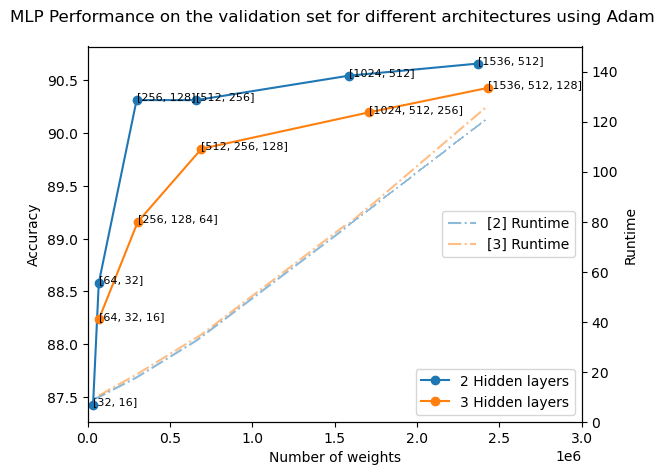
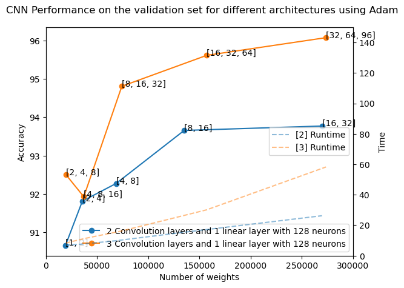
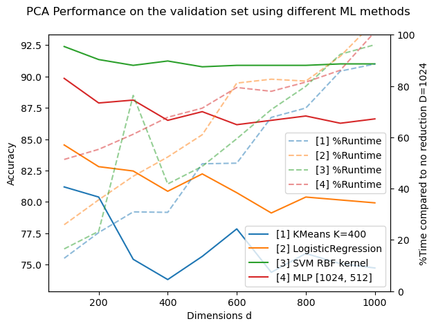

# ML_CLF_HASYv2
Machine learning methods to classify HASYv2 handwritten mathematical symbols

## Introduction

This project implements image recognition using Multi-Layer Perceptron (MLP) and Convolutional Neural Network (CNN) models with PyTorch. We evaluated these models on the HASYv2 dataset (32x32 hand-drawn LaTeX symbols) and explored the impact of Principal Component Analysis (PCA).

## Features

- Data Preparation: Created a validation set, randomized data, and performed data normalization.
- MLP: Tuned architecture and hyperparameters, achieving 91.5% accuracy.
- CNN: Optimized convolutional layers, achieving 97.3% accuracy.
- PCA: Reduced dimensionality for efficiency.

## Results

### Deep Network

| Model | Architecture         | Number of  Parameters | Accuracy | F1 Score |
|-------|----------------------|---------------------------|----------|----------|
| MLP   | [1024, 512]          | 1,584,660                 | 91.5%    | 0.91     |
| CNN   | (32, 64, 96) - [128] | 273,347                   | 97.3%    | 0.972    |

- **CNN Outperforms MLP**: CNN achieved higher accuracy (97.3%) compared to MLP (91.5%) with greater efficiency.

### PCA Results

| Method               | Dimensionality  Reduction (d) | Accuracy  (with / without) | Time Taken* |
|----------------------|-----------------------------------|--------------------------------|-------------|
| KMeans               | 100                               | 82.3% / 79.6%                  | 16%         |
| Logistic Regression  | 100                               | 86.6% / 85.1%                  | 30%         |
| SVM (RBF Kernel)     | 100                               | 93.2% / 92.4%                  | 20%         |
| MLP                  | 100                               | 92.3% / 91.5%                  | 55%         |

*Percentage time compared to original runtime without dimensionality reduction.

- **Significant Time Savings with PCA**: Principal Component Analysis reduced training time considerably without sacrificing accuracy.

- **Deep Neural Networks Shine**: The project highlights the effectiveness of deep neural networks for image classification tasks, making CNN the optimal choice.

## Conclusion:

The results show the effectiveness of deep neural networks, with CNN achieving an impressive average accuracy of 97.3%. In contrast, MLP, while still effective with 91.5% accuracy, demands significantly more parameters and longer training times.

PCA, while marginally improving accuracy, shines in reducing training time, making it particularly valuable for large and complex architectures. For symbol classification tasks, CNN emerges as the optimal choice.

In summary, our study highlights the power of deep neural networks and the efficiency gains offered by PCA, enhancing image classification in practical applications.